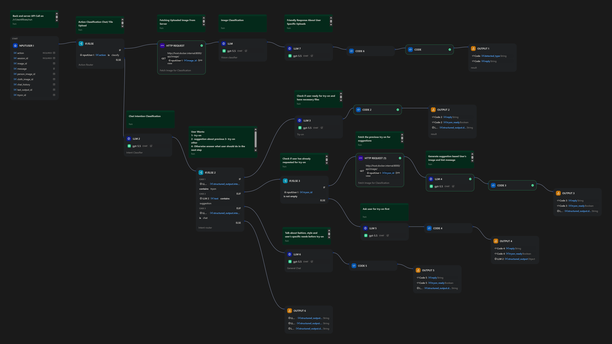

# 👗 AI Fashion Virtual Try-On Agent
An intelligent virtual try-on system powered by an AI agent that understands natural language, classifies uploaded images, and generates realistic outfit try-on results.

## ✨ Features

- 🧠 **AI Agent** — Dify-powered workflow that classifies intent (chat / try-on / suggestion)
- 👤 **Image Classification** — Automatically detects whether an uploaded image is a person or clothing item
- 👗 **Virtual Try-On** — Generates try-on results using [CatVTON](https://github.com/Zheng-Chong/CatVTON) running locally on GPU
- 💬 **Fashion Chat** — Conversational fashion advice based on uploaded images and try-on results
- 🖼️ **Suggestion Mode** — Analyzes try-on results and gives personalized style feedback

## 🏗️ Architecture

Frontend (Gradio)
      ↕
Python Backend (FastAPI)
      ↕
Dify Workflow (Agent / LLM Routing)
      ↕
CatVTON (Local GPU Inference — RTX 5060 8GB)

## Dify flow

## 🛠️ Tech Stack

| Layer | Technology |
|-------|-----------|
| Frontend | Gradio |
| Backend | Python / FastAPI |
| AI Agent | Dify Workflow |
| LLM | GPT-4.5 / GPT-4o |
| Try-On Model | CatVTON |
| Hardware | NVIDIA RTX 5060 8GB |

## 🚀 Getting Started

### Prerequisites

- Python 3.10+
- NVIDIA GPU with CUDA
- Dify instance (self-hosted or cloud)
- OpenAI API key

### Installation

bash
git clone https://github.com/your-username/your-repo
cd your-repo
pip install -r requirements.txt

### Configuration

Create a `.env` file:

env
DIFY_AUTH_TOKE=your_dify_api_key
DIFY_WORKFLOW_URL=http://your-dify-instance/v1/workflows/run
CATVTON_MODEL_PATH=path/to/catvton/weights
TIMEOUT=30

### Run

bash
# Start backend
uvicorn server:app --reload

# Start frontend
python app.py

# Start Dify
docker compose -f .\docker-compose.yaml up -d

## 📁 Project Structure

├── backend.py        # FastAPI backend + CatVTON integration
├── frontend.py       # Gradio chat UI
├── requirements.txt
└── .env.example

## 🔄 Workflow

1. User uploads a **person image** and a **clothing image**
2. Agent **classifies** each image automatically
3. User requests **try-on** → CatVTON generates the result
4. User can ask for **fashion suggestions** based on the try-on
5. General **fashion chat** available throughout

## 📄 License
Creative Commons Attribution-NonCommercial-ShareAlike 4.0 International
